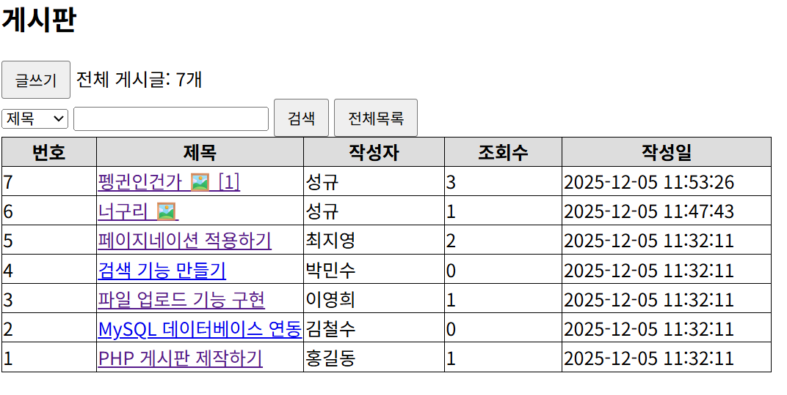
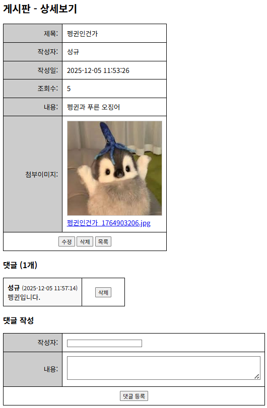
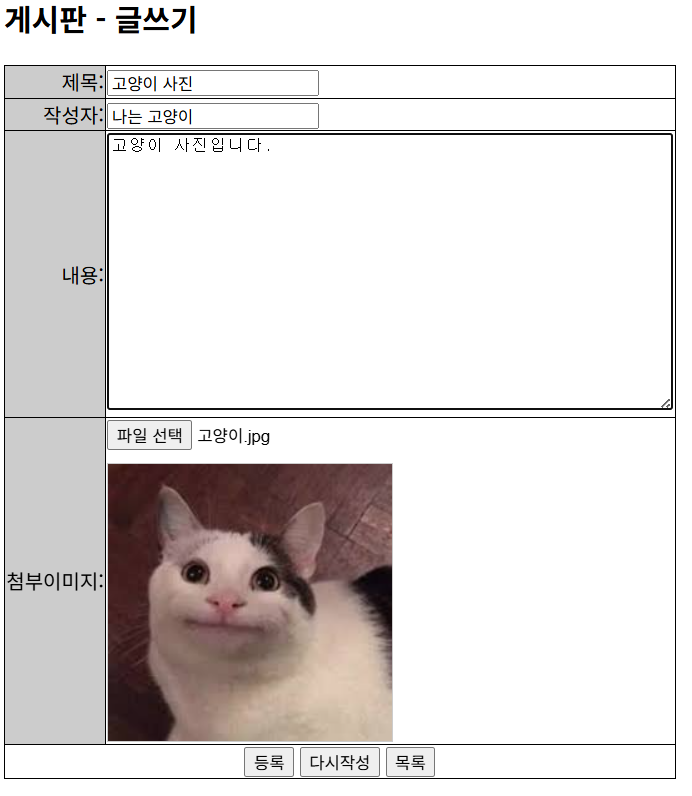
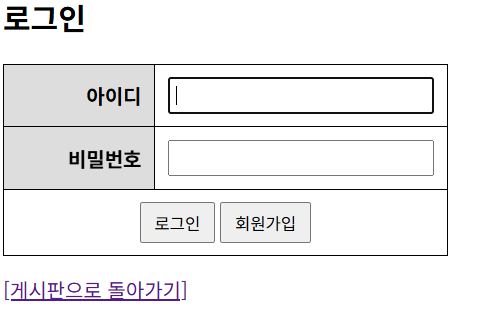
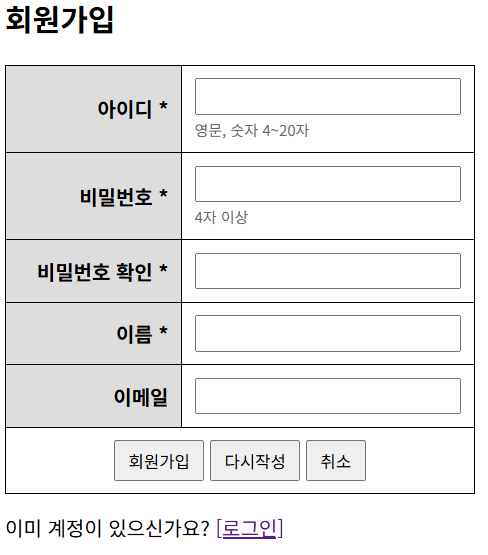
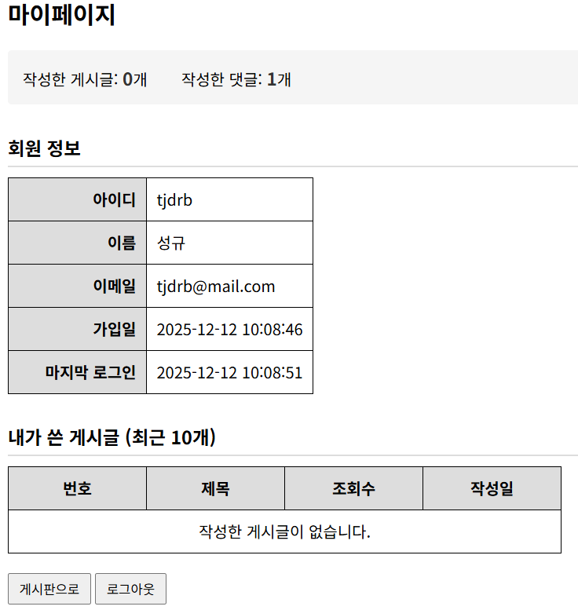
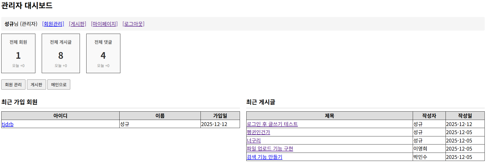
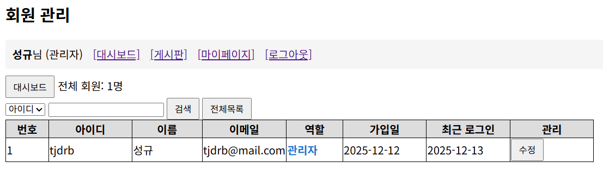
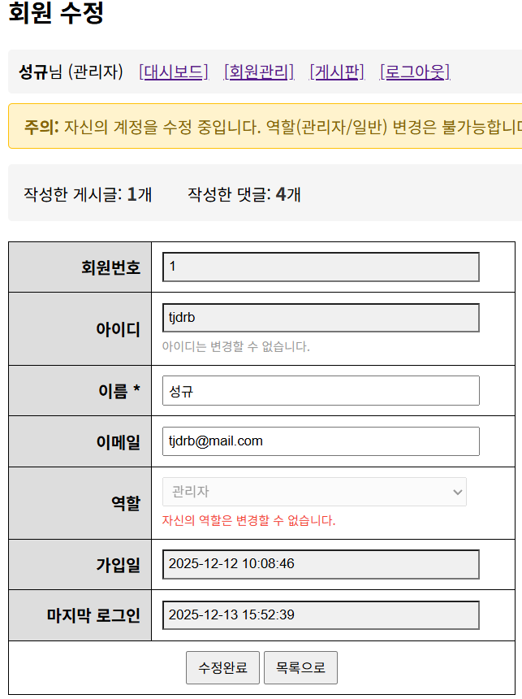

# 이미지 게시판

## 개발 언어
PHP, MySQL, HTML, CSS, JavaScript

## 프로젝트 설명
회원 시스템과 이미지 업로드가 가능한 게시판 시스템

## 구현 기능
- **회원 시스템**
  - 회원가입 (비밀번호 암호화)
  - 로그인/로그아웃 (세션 기반)
  - 마이페이지 (내 정보, 내가 쓴 글 목록)
- **게시판**
  - 게시글 CRUD (로그인 사용자만 작성 가능)
  - 본인 글만 수정/삭제 가능
  - 이미지 업로드
  - 검색 (제목, 작성자, 내용)
  - 페이지네이션
- **댓글**
  - 댓글 작성/삭제 (로그인 사용자만)
- **관리자**
  - 대시보드 (회원/게시글/댓글 통계)
  - 회원 관리 (목록, 검색, 수정, 삭제)
  - 회원 역할 변경 (일반/관리자)
  - 모든 게시글/댓글 수정/삭제 권한

## 설치 방법

### 1. 프로젝트 다운로드
```bash
git clone https://github.com/사용자명/board_project.git
```

### 2. 데이터베이스 설정

#### 2-1. MySQL에서 데이터베이스 생성
```sql
CREATE DATABASE sample01_db;
```

#### 2-2. 테이블 생성
브라우저에서 다음 파일들을 순서대로 실행:
1. `createBoardTable.php` - 게시판 테이블 생성
2. `createCommentTable.php` - 댓글 테이블 생성
3. `createMemberTable.php` - 회원 테이블 생성

또는 `createTable.sql` 파일을 phpMyAdmin에서 실행

#### 2-3. DB 연결 설정
1. `db_config.sample.php` 파일을 복사하여 `db_config.php`로 저장
2. `db_config.php` 파일을 열어 자신의 환경에 맞게 수정

```php
$host = "127.0.0.1";        // 데이터베이스 호스트
$user = "root";             // 데이터베이스 사용자명
$pw = "비밀번호";            // 본인의 MySQL 비밀번호 입력
$dbName = "sample01_db";    // 데이터베이스 이름
$port = 3306;               // MySQL 포트 (XAMPP 기본: 3306)
```

### 3. 웹 서버 실행
XAMPP, WAMP 등의 웹 서버에서 Apache와 MySQL을 실행한 후 브라우저에서 접속:
```
http://localhost/board_project/board_list.php
```

## 파일 구조
```
board_project/
├── admin/                    # 관리자 페이지
│   ├── index.php             # 관리자 대시보드
│   ├── member_list.php       # 회원 목록
│   ├── member_edit.php       # 회원 수정
│   └── member_delete.php     # 회원 삭제
├── img/                      # 업로드된 이미지 저장 폴더
├── screenshots/              # 스크린샷
│
├── # 회원 관련
├── login.php                 # 로그인 폼
├── login_process.php         # 로그인 처리
├── logout.php                # 로그아웃
├── register.php              # 회원가입 폼
├── register_process.php      # 회원가입 처리
├── mypage.php                # 마이페이지
│
├── # 게시판 관련
├── board_list.php            # 목록
├── board_write.php           # 작성 폼
├── board_write_process.php   # 작성 처리
├── board_view.php            # 상세보기
├── board_edit.php            # 수정 폼
├── board_edit_process.php    # 수정 처리
├── board_delete.php          # 삭제 처리
│
├── # 댓글 관련
├── comment_write.php         # 댓글 작성
├── comment_delete.php        # 댓글 삭제
│
├── # 설정 및 초기화
├── db_config.php             # DB 연결 설정 (Git 제외)
├── db_config.sample.php      # DB 연결 설정 샘플
├── createBoardTable.php      # 게시판 테이블 생성
├── createCommentTable.php    # 댓글 테이블 생성
├── createMemberTable.php     # 회원 테이블 생성
├── addRoleColumn.php         # 관리자 기능 초기화 스크립트
└── createTable.sql           # SQL 테이블 생성 스크립트
```

## 스크린샷

### 게시판
| 목록 | 상세보기 | 글쓰기 |
|------|----------|--------|
|  |  |  |

### 회원
| 로그인 | 회원가입 | 마이페이지 |
|--------|----------|------------|
|  |  |  |

### 관리자
| 대시보드 | 회원 목록 | 회원 수정 |
|----------|----------|----------|
|  |  |  |
